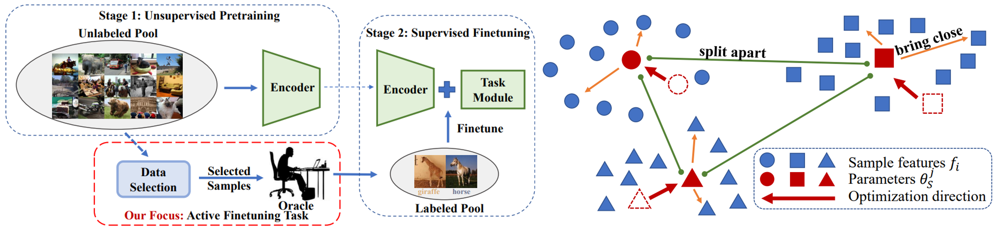

# Active Finetuning: Exploiting Annotation Budget in the Pretraining-Finetuning Paradigm (CVPR 2023)
## Abstract

To fill the data selection gap in the pretraining-finetuning paradigm, we formally define this new active finetuning task focusing on the selection of samples for annotation in the pretraining-finetuning paradigm. We propose a novel method called ActiveFT for the active finetuning task to select a subset of data distributing similarly with the entire unlabeled pool and maintaining enough diversity by optimizing a parametric model in the continuous space. We prove that the Earth Mover’s distance between the distributions of the selected subset and the entire data pool is also reduced in this process. Extensive experiments show the leading performance and high efficiency of ActiveFT superior to baselines on both image classification and semantic segmentation.

[[paper link]](https://arxiv.org/abs/2303.14382)



## Installation

#### Environment

This codebase has been developed with CUDA 11.2, python 3.7, PyTorch 1.7.1, and torchvision 0.8.2. Please install [PyTorch](https://pytorch.org/) according to the instruction on the official website.

You also need to install [pytorch-image-models 0.3.2](https://github.com/rwightman/pytorch-image-models) for model finetuning with [DeiT](https://github.com/facebookresearch/deit/blob/main/README_deit.md).

```
pip install timm==0.3.2
```

#### Data Preparation

If you experiment on CIFAR10 or CIFAR100, the dataset would be automatically downloaded to `data_selection/data` and `deit/data`. For [ImageNet](https://www.image-net.org/), you have to manually download it and link to `data_selection/data/ImageNet` and `deit/data`. 

## ActiveFT Data Selection

#### Feature Extraction

Before data selection, you need to extract the features with a pretrained model. 

```
cd data_selection/
python extract_feature.py --dataset ${DATASET (one of the three: CIFAR10, CIFAR100 or ImageNet)}
```

Our default setting applies the DeiT-Small model pretrained with DINO ([ckpt](https://dl.fbaipublicfiles.com/dino/dino_deitsmall16_pretrain/dino_deitsmall16_pretrain.pth)). You can also specify other models in `data_selection/extract_feature.py`.

#### Data Selection

With extracted features, you can select a subset from the dataset with the following command.

```
# For CIFAR10 or CIFAR100:
python sample_tools/ActiveFT_CIFAR.py --feature_path ${PATH to the extracted feature} --percent ${sampling percentage}

# For ImageNet:
python sample_tools/ActiveFT_ImageNet.py --feature_path ${PATH to the extracted feature} --percent ${sampling percentage}
```


## Model Finetuning

We implement the model finetuning with our selected data subset based on the code base of [deit](https://github.com/facebookresearch/deit). You modify their code to allow the training on the selected subsets.

First, make sure you have downloaded the pretrained ViT model. In our default setting, we finetune the DeiT-Small model pretrained with DINO ([ckpt](https://dl.fbaipublicfiles.com/dino/dino_deitsmall16_pretrain/dino_deitsmall16_pretrain.pth)).

Then, you can run the following command to finetune the model.

```
cd deit/

python -m torch.distributed.launch --nproc_per_node=2 --master_port 29501 --use_env main.py --clip-grad 2.0 --eval_interval 50 --data-set ${DATASET (one of the three: CIFAR10SUBSET, CIFAR100SUBSET or IMNETSUBSET)} --subset_ids ${JSON file for selected subset} --resume ${checkpoint (.pth) to be finetuned} --output_dir ${OUTPUT DIR}
```

## Acknowledgment

The code of this repo is developed based on [dino](https://github.com/facebookresearch/dino) and [deit](https://github.com/facebookresearch/deit). We sincerely thank the authors for making their projects open-source.

## Reference

If you find our work useful, please consider citing the following paper:

```
@article{xie2023active,
  title={Active Finetuning: Exploiting Annotation Budget in the Pretraining-Finetuning Paradigm},
  author={Xie, Yichen and Lu, Han and Yan, Junchi and Yang, Xiaokang and Tomizuka, Masayoshi and Zhan, Wei},
  journal={arXiv preprint arXiv:2303.14382},
  year={2023}
}
```

